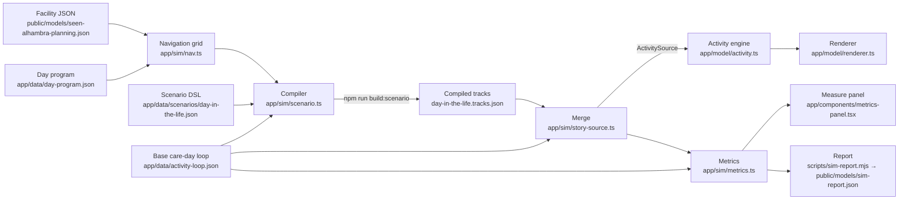

# Care-day simulation

The facility model can be *programmed, played and measured*. A scenario file
describes an itinerary on the shared care-day clock; a compiler turns it into
walking and activity tracks on navigable routes through the modeled building;
the existing activity engine animates them; and a measurement layer samples the
same tracks to report occupancy, staff time and a participant's touchpoints.

Everything here is composite and illustrative. No participant records are used.

## Architecture



- **Build time** (Node): `scripts/build-scenario.mjs` bundles the TypeScript
  modules with Rolldown (already installed with Vite) into `work/sim/`, compiles
  the scenario, validates it and writes the tracks JSON.
- **Run time** (browser): `storyActivitySource()` merges the precompiled tracks
  into the base loop. No navigation work happens in the browser.
- **Measurement** uses `sampleActor`, `sampleEscort` and `samplePairedActors`
  from the activity engine, so it measures exactly what is animated.

## The clock

One 720-second loop is the 8 AM–4 PM day: 1 loop second = 2/3 of a clock
minute. Vans (`vanWindows` in `app/model/arrival.ts`), the day-room program and
every activity source run on this clock. `app/sim/clock.ts` converts between loop
seconds, clock minutes and labels:

| Helper | Example |
| --- | --- |
| `clockLabel(155)` | `9:43 AM` (same as `dayTime`) |
| `loopToMinutes(t)` / `minutesToLoop(m)` | 155 ↔ 583.3 |
| `clockToLoop('12:30 PM')` | 405 |
| `loopDurationMinutes(45)` | 30 |
| `hourTicks()` | chart ticks for 8 AM … 4 PM |

## Navigation (`app/sim/nav.ts`)

A TypeScript port of the grid in `scripts/build-activity.py`, with identical
results: 0.2 m cells; 0.21 m wall clearance; furniture footprints (including
`navigationFootprints`) inflated by 0.19 m; cleared day-program furniture; the
reserved group stations and presentation screen; 8-connected A* without corner
cutting; collinear simplification. `navGrid(model, dayProgramNavOptions(true))`
reproduces the Python grid exactly (22,063 walkable cells; 20,099 at cane
clearance) and builds in about 0.4 s in Node, cached per model and options.

Additions over the Python grid:

- **Any clearance per route**: each cell stores its wall margin and furniture
  margin, so `route(grid, a, b, 0.26)` gives a cane route (walker 0.33,
  wheelchair 0.37) without rebuilding.
- **Vertical circulation** (`blockVerticalCirculation`, on by default): stair
  flights, the lift and floor voids are obstacles. The Python grid treats stairs
  as walkable because they are `architecture`.
- **Any level**: `navGrid(model, { levelId: 'upper', … })` for upstairs routes.
- **Connected components**: `snap` only returns cells on the main circulation,
  never an isolated pocket between furniture.
- `routeBetween`, `zoneAt`, `roomAt`, `wallClearanceAt`, `isClear` helpers.

## Authoring a scenario

`app/data/scenarios/day-in-the-life.json` has two owners. The **story** owns
copy (`title`, `kicker`, `body`, the hero's summary). The **simulation** owns
`placement` blocks. Step `window`s, `roomId`, `roles` and `handoffs` are the
shared contract.

### Scenario-level placement

```jsonc
"placement": {
  "heroGait": { "preferred": 0.78, "max": 1.45, "clearance": 0.26, "step": 0.02 },
  "staffGait": { "preferred": 0.95, "max": 1.5 },
  "minDwellFraction": 0.3,        // share of each window at the anchor
  "minDwellSeconds": 8,
  "replaced": {                     // the base actor the hero takes over
    "arrivalThroughTitle": "Front desk greeting & check-in",
    "departureTitle": "Escorted departure · board van",
    "escortId": "arrival-aide-a", "escortLabel": "PCA · Alex",
    "boardingSpeed": 0.64
  },
  "reservations": [ … ],            // extra areas new routes avoid
  "reserveBaseDwell": { "minSeconds": 40, "halfSize": 0.3 },
  "companions": [                   // staff who appear for the hero
    { "id": "idt-rn", "team": "rn", "name": "Grace", "variant": 22, "home": [-1.9, -3.0] },
    { "id": "idt-rec", "team": "rec", "name": "Dani", "variant": 28,
      "home": [12.0, 12.4], "exit": [-13.3, 4.3] }
  ],
  "meeting": { "levelId": "upper", "roomId": "upperfit-conference",
               "steps": ["huddle", "care-plan"], "entry": [4.97, 13.99], … }
}
```

`team` is a `care-team.json` id; the character role comes from its
`characterRole`. `home` is a back room where the companion appears and
disappears (`visible: false` off duty); `exit` optionally differs.

### Step placement

```jsonc
"placement": {
  "mode": "visit",                  // meeting | arrival | checkin | visit | departure
  "stops": [{
    "id": "clinic",
    "window": [140, 185],           // when this stop should be on screen
    "roomId": "clinic-treatment-south",
    "seat": "clinic-south-recliner",// anchor + facing from a furniture object
    "seated": true,
    "action": "idle",               // any character Action
    "approach": [[-9.8, -3.1], [-8.8, -3.3], [-8.75, -3.9]],
    "title": "Blood-pressure recheck and medication review",
    "category": "clinical",         // interaction category (UI filters, metrics)
    "companions": [
      { "id": "idt-rn", "anchor": [-6.8, -4.35], "action": "treat",
        "approach": [[-5.2, -4.6]], "leave": 5 },
      { "id": "idt-pcp", "seat": "clinic-south-stool", "heading": 2.22,
        "seated": true, "action": "consult", "join": 5, "leave": -2 }
    ],
    "partners": []                  // base actors who take part (interaction only)
  }]
}
```

- `anchor` or `seat` places a person. Seats face the front of the furniture
  (recliners and barber chairs face +Z, chairs and stools −Z). Standing anchors
  that end up inside furniture are nudged clear with a note, so the compile keeps
  working when furniture changes.
- `approach` waypoints lead from free floor to the anchor (e.g. through a door
  and around a stool) and are reversed on the way out. Every leg is checked for
  0.2 m wall clearance.
- `join` / `leave` time companions relative to the hero's arrival/departure
  (defaults −3 s and +1 s: they wait for her and see her off).
- `followProgram: true` takes the open-floor program's standing action for each
  session the hero overlaps (movement sessions are copied; others become
  listening). The long arts table and tea corner run concurrently and are not
  followed.
- `minDwell` overrides the minimum seconds at a stop.
- `duties` (with absolute `window`s) attach companions to steps where the hero
  follows copied tracks, e.g. the center manager at check-in.

### What the compiler does

1. Copies the replaced actor's van ride, ramp, sliding entrance and check-in
   (heights, `vehicleId`, `ride` stages intact).
2. Routes every leg between stops on the cane-clearance grid.
3. Chooses a gait and schedule: a least-squares fit of each stop's dwell to the
   centre of its window, with minimum dwells, at the slowest feasible gait; among
   the next few feasible gaits it keeps the one whose walks cross moving base
   actors least, then slides single legs by up to ±4 s to avoid remaining
   crossings.
4. Re-uses the replaced actor's departure: the same exterior path, ramp, van and
   boarding time; the indoor part is re-routed from the farewell spot.
5. Re-points the replaced actor's escort (`escortFor`) to the hero, so the PCA
   walks behind her all day on her exact path.
6. Schedules companions from their duties: appear at home, walk in, perform,
   walk directly to the next duty or go back to base when there is time, and
   vanish at home. Walks are re-timed by up to ±8 s when they would pass through
   someone.
7. Builds the upstairs IDT meetings: attendees appear at the stair landing, walk
   in along the aisles (farthest seats first, nearest seats leave first), sit and
   take turns presenting. Each attendee shares a profile with the downstairs
   person they are, so the same RN is seen at the huddle and in the clinic.
8. Emits interactions per stop, arrival, check-in, departure and meeting, and a
   `steps` summary with arrive/depart and a **focus time** for each step.
9. Removes the replaced actor and its interactions from the merged source.

## Running it

```bash
npm run build:scenario                  # compile, validate, write tracks JSON
node scripts/build-scenario.mjs --check # compile and validate only
node scripts/build-scenario.mjs --check --model path/to/facility.json
node scripts/sim-report.mjs             # report + public/models/sim-report.json
```

Re-run `npm run build:scenario` after changing the facility (e.g. new
furniture), the base loop or the scenario. Validation checks:

- every stage covers 0–720 contiguously, with no teleport between stages or on
  repeat, and a timeline that covers the day;
- every visible walking path stays ≥ 0.2 m from walls (sampled every 5 cm), and
  no visible pose is within 0.15 m of a wall;
- no visible jump larger than 0.6 m between samples; the escort moves less than
  0.13 m per 0.05 s;
- the hero is at each stop's anchor for at least its minimum dwell inside the
  window, and at the anchor at the step's focus time;
- the hero boards Van A only when it is parked with doors and ramp open;
- new walks keep clear of the day-room activity stations;
- it reports walks through furniture footprints and close contacts (< 0.45 m)
  between new people and anyone else, for review.

## Using the story source

```ts
import { storyActivitySource, storySteps, storyStep } from '@/app/sim/story-source';

const { source, heroId } = storyActivitySource(); // memoised ActivitySource
createViewer(host, model, onSelect, { activity: source });
const clinic = storyStep('clinic');
viewer.activity.setOptions({ time: clinic.focusTime, playing: false });
viewer.followActor(clinic.focusActorId); // 'hero-lin' or 'interaction:idt-huddle'
```

Each `CompiledStep` has `window`, `focusTime`, `focusActorId`, `stops` (anchor,
heading, action, arrive/depart, overlap, companions, partners, interaction id),
`companionIds`, `interactionIds`, `handoffs` and `roles`.

## What is measured (`app/sim/metrics.ts`)

`computeMetrics(source, model, { step, heroId, steps })` samples every actor
every `step` loop seconds (1 s in the report, 2 s in the panel):

| Measure | Definition |
| --- | --- |
| Zone occupancy | visible participants and staff per zone at each sample (ground zones by point-in-polygon, like the engine; `site` outdoors); peaks, means and person-hours |
| On site | participants and staff visible anywhere |
| Staff utilization | per role and per person: **direct care & programs** (treat, consult, tabletop, exercise, serve, greet, present, conversation, music …), **walking & escorting**, **documenting & standby** (document, idle, listen), **team meetings** (seated upstairs), **driving**; shares of on-duty time |
| Walking distance | visible displacement per person, averaged per role |
| Participant time | per participant: arrivals, clinical, therapy, activities, meals, coordination (from interaction categories), walking between, waiting & free time, off site |
| Hero touchpoints | per IDT discipline: minutes with someone of that discipline within 1.6 m or in a shared interaction, encounters, first time |
| Handoffs | counted from the scenario's step handoffs, per step and discipline |

Staff are counted as people: tracks sharing a `profileId` (an upstairs meeting
attendee and the same person downstairs) are one person.

The **Measure** panel (header → Measure) shows occupancy small multiples by zone
(click to jump the playback), staff time by role and, for the story scenario,
Mrs. Lin's care team, with a marker synced to the viewer clock. Compare the base
loop and "With Mrs. Lin's day" with the scenario toggle.

## Limitations

- **Compressed time vs. real distances.** The hero walks about 300 m between
  ten stops in roughly 415 loop seconds, which needs a gait near 1.26 m/s per
  loop second (the base loop uses 0.62–0.78). Time on screen is compressed, so
  this reads as brisk rather than wrong, but the step windows are tight for the
  building's distances, especially recreation (table tennis in the rear
  northeast, karaoke by the entrance, 49 m apart) and the dwell at each stop is
  9–48 s. The report shows the walking burden explicitly.
- Collision handling is static reservations plus local re-timing, not
  continuous avoidance. Brief close passes with base actors remain and are
  listed by the build.
- The escort follows the hero's path at a fixed 0.95 m gap, so when she sits it
  stands on her approach path (by a doorway or behind her chair).
- People do not climb stairs. Upstairs meeting attendees are separate tracks that
  appear at the stair landing; identity is shared through `profileId`.
- Anchors were chosen before the table-tennis table and karaoke furniture landed;
  the compile nudges standing anchors out of furniture and reports crossings,
  but approach waypoints are authored.
- The base loop already has two waiting participants sharing one desk spot
  (`arrival-cane` and `arrival-wheelchair` at (−10.4, 1.6)); the hero's farewell
  therefore uses a spot beside the desk.
- Metrics describe illustrative composite tracks, not operations.

## Roadmap toward discrete-event simulation

The compiled-track approach is a scripted day. A discrete-event layer would
generate the day instead:

1. **Entities and resources.** Participants with care plans (visit types,
   durations, mobility); staff with rosters and skills; rooms and equipment with
   capacities (exam rooms, parallel bars, dining seats, vans).
2. **Stochastic arrivals.** Van runs with delay distributions, variable
   attendance, walk-in visits, weather or traffic scenarios.
3. **Queues and waits.** Requests for a nurse, therapist or room queue when the
   resource is busy; measure waits, idle time and abandonment.
4. **Staffing rosters.** Shift start/end, breaks, float staff; compare rosters
   by care time delivered and walking burden.
5. **Events → tracks.** Keep this compiler as the renderer's back end: each
   simulated event becomes a stop with an anchor and duration, routed on the same
   grid, so every what-if can be watched as well as measured.
6. **What-if runs.** Many replications per scenario (seeded), confidence
   intervals on KPIs, side-by-side comparison in the Measure panel: room swaps,
   new equipment, a second van, a different program timetable.
7. **Calibration.** Fit durations and arrival patterns to aggregated,
   de-identified operational data, and keep the source basis visible.

## Reconciled layout

The story uses the reviewed community rooms from the three-site model. `placement.replacedBackgroundActors` reserves activity positions for the story cast without changing the normal facility population. The compiler checks wall clearance and continuity and reports close pedestrian encounters; this is an illustrative simulation, not a guarantee of collision-free crowds or real-world accessibility. Vehicle traffic has a separate `npm run validate:traffic` clearance check.
